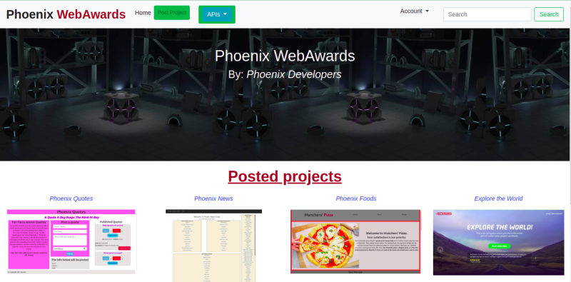
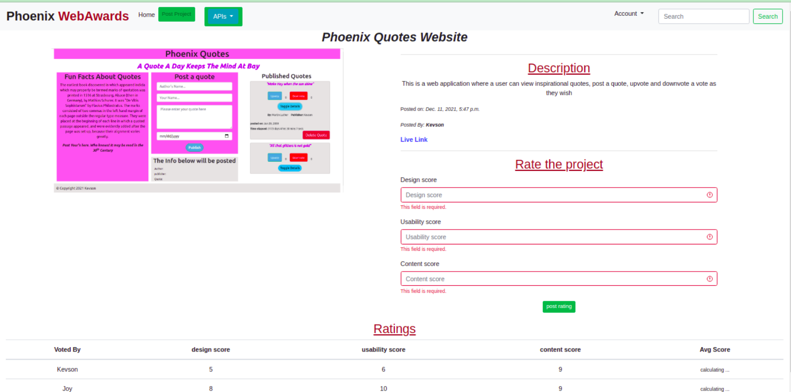
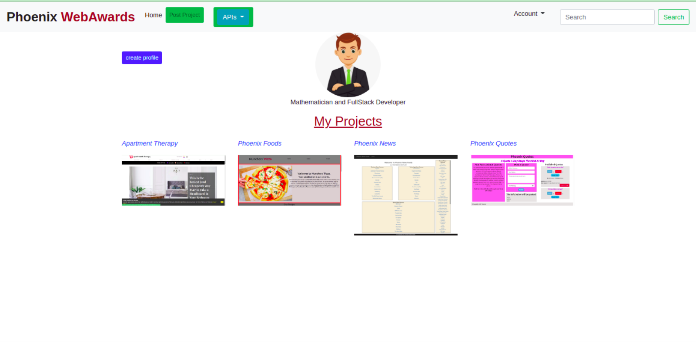
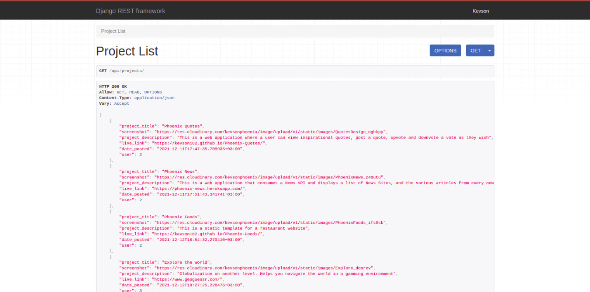

# Phoenix WebAwards

# Author
Built by: Nyambura Njuguna

# Description
This Repository holds a web-rating application where the user can view posted projects, login to view the details of the projects, rate the projects, and post their projects for rating. The user can also create and view their profile.

## User Story
The user can:
* View posted projects
* Login or Sign up to view the project details
* Rate the posted projects with a score of between 1 - 10
* Upload a project for rating
* See their profile with all the projects they have uploaded

# Design
### Home page

### Detailed picture page

### Search results page

### REST API page

# Prerequisites
* python3.9
* pip
* Django

# Cloning
Open Terminal:

  $ git clone https://github.com/Kevson102/Phoenix-Web-Awards.git

  $ cd Phoenix-Web-Awards
  
  $ code . or atom . based on your text editor 
  
# Install all dependencies in requirements.txt

  $ pip install -r requirements.txt
  
# Running the Application
- on the code editor, change the configuration settings from prod to dev
* To run the application, open the cloned repo in terminal and run the following commands:

  $ python3.9 manage.py runserver

# Technologies Used
python 3.9
django
Django-Bootstrap4
Heroku - online deployment

Support and contact details
Incase of any issues at hand, please email me at kevson3941@gmail.com

# License
MIT License.
